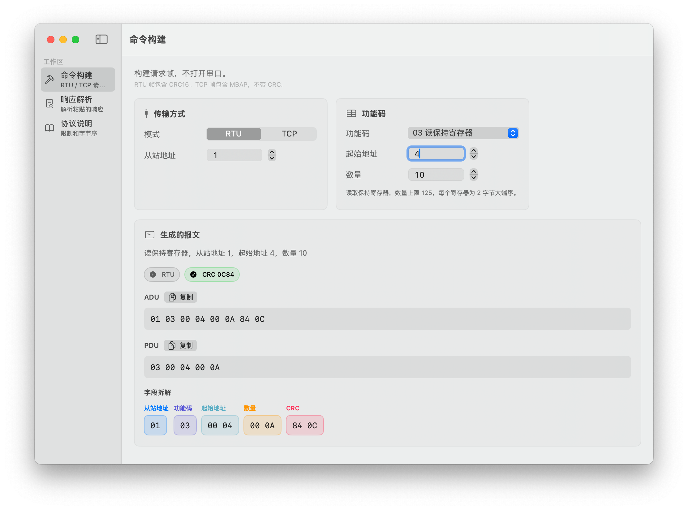
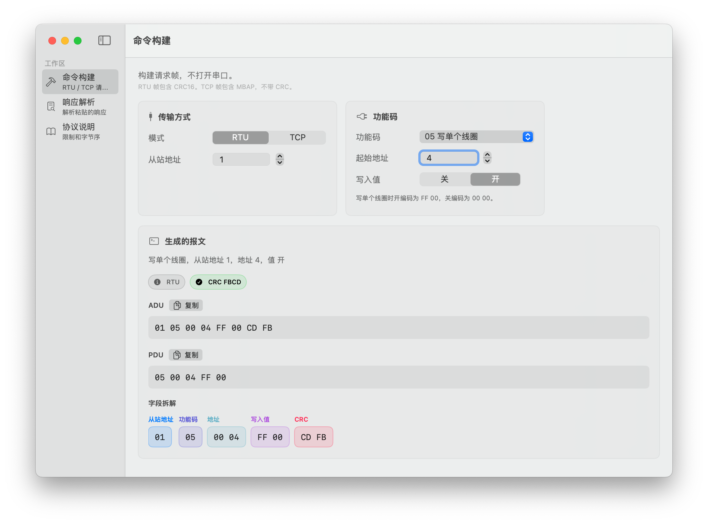
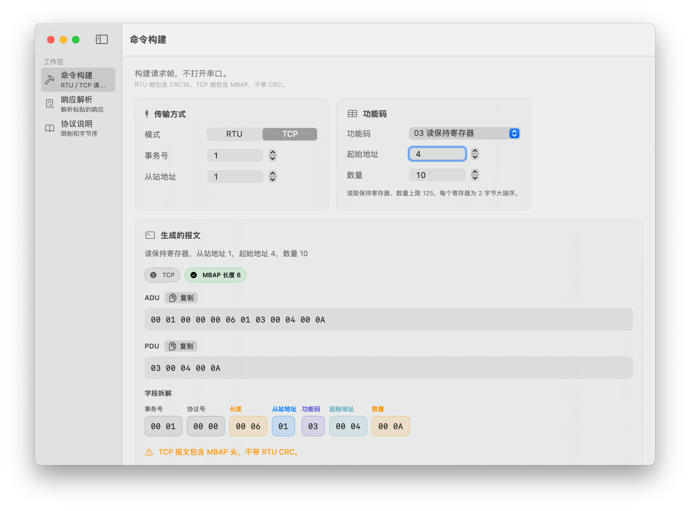
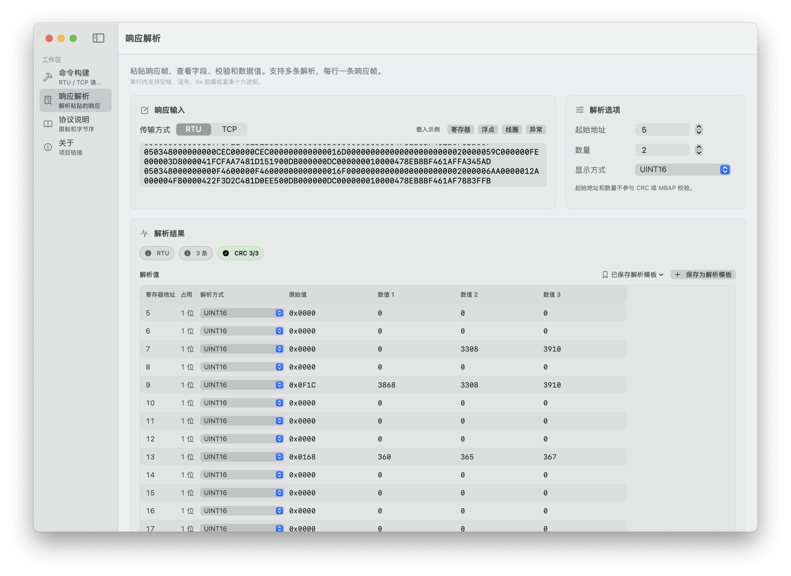
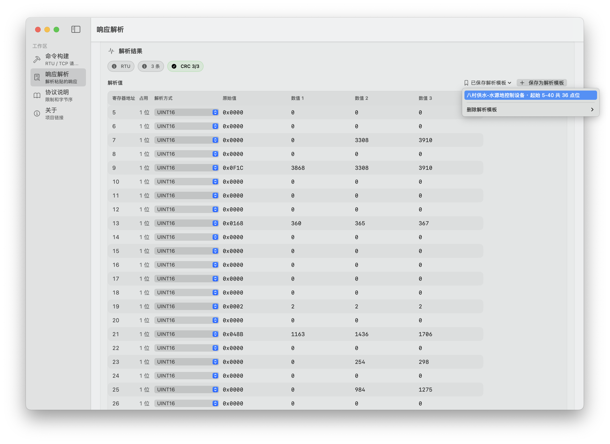
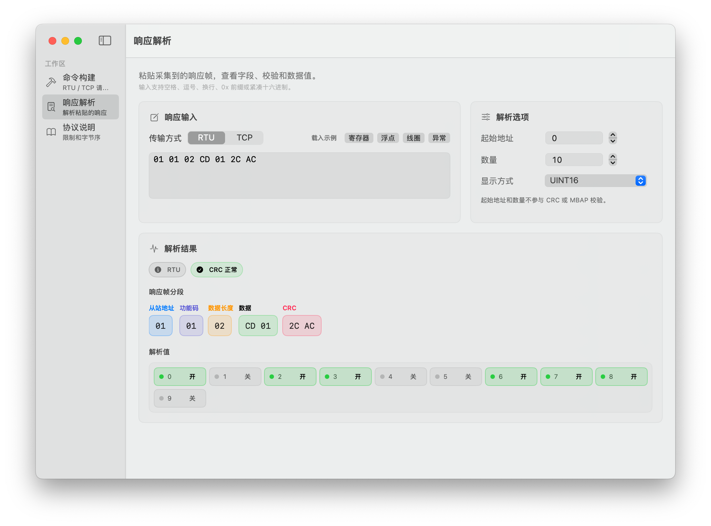
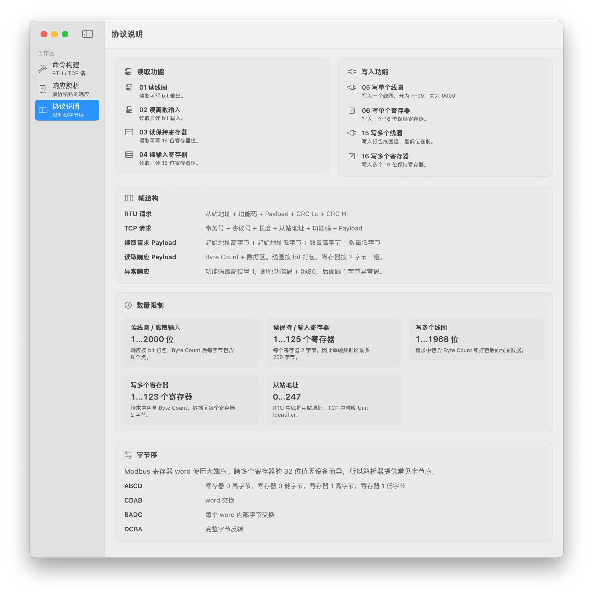

# ModbusWorkbench

[](https://github.com/minivv/ModbusWorkbench/actions/workflows/ci.yml)
[](LICENSE)

ModbusWorkbench 是一个 macOS 原生 Modbus 调试小工具。不打开串口、不建立 TCP 连接，只专注于离线报文工作：

- 构建 Modbus RTU / TCP 请求帧
- 粘贴响应帧后解析字段、CRC、寄存器、线圈和异常响应
- 对寄存器数据进行 U16、I16、U32、I32、Float 等常见格式解码
- 支持多个响应帧同时解析对比
- 支持把常用的解析格式保存为模板，目前最多 24 个模板
- 支持 macOS 13 或 更高版本

## 界面

Modbus RTU 读保持寄存器的命令构建

Modbus RTU 写单个线圈的命令构建

Modbus TCP 读保持寄存器的命令构建

多个响应帧解析对比

保存和应用解析模板

读线圈解析 友好可视化开关值

协议说明


## 下载安装

请从 [GitHub Releases](https://github.com/minivv/ModbusWorkbench/releases) 下载：

```text
ModbusWorkbench-<version>-macos-universal.zip
```

解压后把 `ModbusWorkbench.app` 拖到 `/Applications` 即可。没有 Developer ID 签名和公证的版本，首次打开时 macOS 可能会提示无法验证开发者；可以右键点击 app 后选择“打开”，或在系统设置的隐私与安全性中允许打开。

## 环境要求

- macOS 13 或更高版本
- Swift 5.9+
- Xcode Command Line Tools，或完整 Xcode

检查 Swift 是否可用：

```bash
swift --version
```

## 开发

进入项目目录后运行测试：

```bash
swift test
```

构建并打开 app：

```bash
./script/build_and_run.sh
```

只验证 app 能构建并启动：

```bash
./script/build_and_run.sh --verify
```

开发构建产物会在：

```text
dist/ModbusWorkbench.app
```

## 发布包

本地生成 GitHub Release zip：

```bash
swift test
./script/package_release.sh 0.1.0
```

产物会在：

```text
dist/release/
```

创建正式版本时推送语义化版本标签：

```bash
git tag v0.1.0
git push origin v0.1.0
```

GitHub Actions 会自动测试、打包并创建 Release。更详细的签名和公证说明见 [docs/RELEASE.md](docs/RELEASE.md)。

默认发布包是 universal binary，支持 Apple Silicon 和 Intel Mac。如果本机环境不能交叉构建，可以只构建当前架构：

```bash
UNIVERSAL_BINARY=0 ./script/package_release.sh 0.1.0
```

## 设置应用图标

构建脚本会自动读取：

```text
Resources/AppIcon.icns
```

只要这个文件存在，脚本就会把它打包进 `dist/ModbusWorkbench.app`。

不用工具时，也可以用 macOS 自带命令从 1024 x 1024 PNG 生成：

```bash
mkdir -p Resources/AppIcon.iconset
sips -z 16 16 icon.png --out Resources/AppIcon.iconset/icon_16x16.png
sips -z 32 32 icon.png --out Resources/AppIcon.iconset/icon_16x16@2x.png
sips -z 32 32 icon.png --out Resources/AppIcon.iconset/icon_32x32.png
sips -z 64 64 icon.png --out Resources/AppIcon.iconset/icon_32x32@2x.png
sips -z 128 128 icon.png --out Resources/AppIcon.iconset/icon_128x128.png
sips -z 256 256 icon.png --out Resources/AppIcon.iconset/icon_128x128@2x.png
sips -z 256 256 icon.png --out Resources/AppIcon.iconset/icon_256x256.png
sips -z 512 512 icon.png --out Resources/AppIcon.iconset/icon_256x256@2x.png
sips -z 512 512 icon.png --out Resources/AppIcon.iconset/icon_512x512.png
sips -z 1024 1024 icon.png --out Resources/AppIcon.iconset/icon_512x512@2x.png
iconutil -c icns Resources/AppIcon.iconset -o Resources/AppIcon.icns
```

其中 `icon.png` 换成你的原始图标图片路径。

## 目录结构

| 路径 | 作用 |
| --- | --- |
| `Package.swift` | SwiftPM 项目配置，定义 app target 和 test target。 |
| `Sources/ModbusWorkbench/App/ModbusWorkbenchApp.swift` | app 入口、窗口最小尺寸、菜单命令。 |
| `Sources/ModbusWorkbench/Views/CommandBuilderView.swift` | 命令构建界面，生成 ADU / PDU。 |
| `Sources/ModbusWorkbench/Views/ResponseParserView.swift` | 响应解析界面，展示字段分段、解析值和异常信息。 |
| `Sources/ModbusWorkbench/Services/ModbusCodec.swift` | Modbus 请求构建和响应解析核心逻辑。 |
| `Sources/ModbusWorkbench/Services/ModbusCRC.swift` | RTU CRC16 计算。 |
| `Sources/ModbusWorkbench/Services/NumberDecoder.swift` | 寄存器、线圈和浮点数值解析。 |
| `Tests/ModbusWorkbenchTests/ModbusCodecTests.swift` | 构建、解析、CRC、浮点显示等自动测试。 |
| `script/build_and_run.sh` | 本地调试构建并打开 app。 |
| `script/package_release.sh` | 生成 GitHub Release 用 zip 和 sha256。 |

## 当前限制

- 不打开串口，不建立真实 TCP 连接。
- 默认发布包未签名、未公证，正式广泛分发建议配置 Developer ID 签名和 Apple notarization。

## 参与贡献

请阅读 [CONTRIBUTING.md](CONTRIBUTING.md)。安全问题请参考 [SECURITY.md](SECURITY.md)。

## License

MIT License. See [LICENSE](LICENSE).
